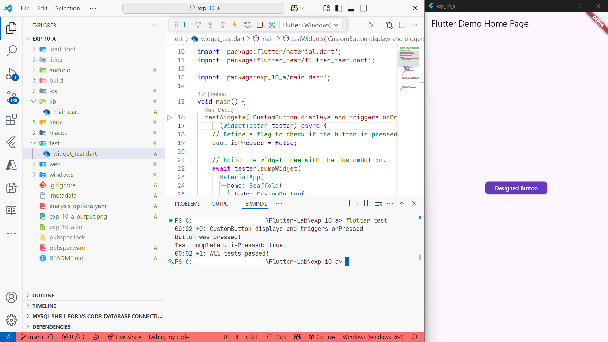
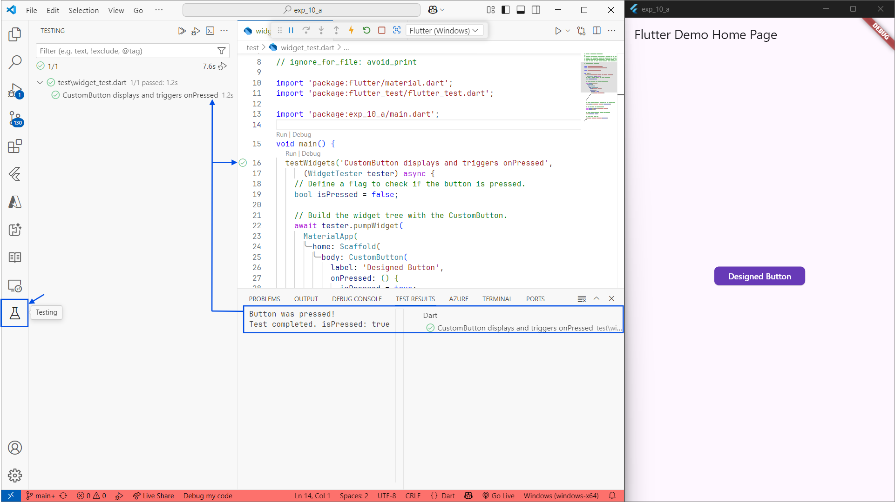

# Experiment 10 - Part A: **Unit Tests for UI components**

## Aim
To write unit tests for UI components in a Flutter application.

## Objective
In this experiment, you will learn how to:
- Create unit tests for Flutter widgets.
- Use the `flutter_test` package to validate UI behavior.
- Ensure the reliability of UI components through automated testing.

## System Requirements
- **Flutter SDK**: version 2.0.0 or higher
- **Dart SDK**: version 2.12.0 or higher
- **IDE**: Visual Studio Code (latest version) or Android Studio (latest version)
- **Operating System**: Windows (7 or higher), macOS (10.12 or higher), or Linux (Ubuntu, Debian, Fedora, CentOS, or similar)

## Procedure

1. Create a new Flutter project by running the following command in your terminal:
    ```cmd
    flutter create exp_10_a
    ```
    The command creates a Flutter project directory called `exp_10_a` that contains a simple demo app that uses [Material Components](https://m3.material.io/components).

2. Change to the Flutter project directory.
    ```cmd
    cd exp_10_a
    ```
3. Open the `lib/main.dart` file in your Flutter project.

4. Replace the existing code with the following code snippet:
    ```dart
    import 'package:flutter/material.dart';

    void main() => runApp(const MainApp());

    class MyApp extends StatefulWidget {
      const MyApp({super.key});

      @override
      State<MyApp> createState() => _MyAppState();
    }

    class _MyAppState extends State<MyApp> {
      @override
      Widget build(BuildContext context) {
        return MaterialApp(
          title: 'Flutter Demo',
          theme: ThemeData(
            primarySwatch: Colors.blue,
          ),
          home: Scaffold(
            appBar: AppBar(
              title: const Text('Flutter Demo Home Page'),
            ),
            body: Center(
              child: CustomButton(
                  label: 'Designed Button',
                  onPressed: () {
                    // Handle button press here
                  }),
            ),
          ),
        );
      }
    }

    class CustomButton extends StatelessWidget {
      final String label;
      final VoidCallback onPressed;

      const CustomButton({
        super.key,
        required this.label,
        required this.onPressed,
      });

      @override
      Widget build(BuildContext context) {
        return ElevatedButton(
          style: ElevatedButton.styleFrom(
            backgroundColor: Colors.deepPurple,
            foregroundColor: Colors.white,
            padding: const EdgeInsets.symmetric(horizontal: 24, vertical: 12),
            shape: RoundedRectangleBorder(
              borderRadius: BorderRadius.circular(8),
            ),
          ),
          onPressed: onPressed,
          child: Text(label),
        );
      }
    }
    ```

5. Save the file.

6. Run your Flutter project using the following command:
    ```cmd
    flutter run
    ```
    Select the appropriate device to run the app.

7. During the app execution, you can use the following commands:
    - Enter `r` to hot reload the app and see the changes you made to the code.
    - Enter `q` to quit the app.

8. To add unit tests, create a new file named `custom_button_test.dart` in the `test` directory of your project and edit it with the following code:
    ```dart
    import 'package:flutter/material.dart';
    import 'package:flutter_test/flutter_test.dart';
    import 'package:exp_10_a/main.dart';

    void main() {
      testWidgets('CustomButton displays correctly and responds to taps', (WidgetTester tester) async {
        // Define a flag to check if the button is pressed.
        bool isPressed = false;

        // Build the CustomButton widget
        await tester.pumpWidget(
          MaterialApp(
            home: Scaffold(
              body: CustomButton(
                label: 'Test Button',
                onPressed: () {
                  isPressed = true; // Variable to track if the button was pressed
                },
              ),
            ),
          ),
        );

        // Verify that the button is displayed
        expect(find.text('Test Button'), findsOneWidget);

        // Tap the button and verify that the onPressed callback is called
        await tester.tap(find.text('Designed Button'));
        await tester.pump(); // Rebuild the widget after the tap

        // Verify that the button is still displayed after tapping
        expect(find.text('Test Button'), findsOneWidget);
        // Verify that the onPressed callback is triggered.
        expect(isPressed, isTrue);
      });
    }
    ```
9. To run the unit tests, use:
    ```cmd
    flutter test
    ```

## Output
The app displays a centered custom-styled button labeled "Designed Button" on the home page.

```powerShell
PS C:\Flutter-Lab\exp_10_a> flutter test
00:02 +0: CustomButton displays and triggers onPressed
Button was pressed!
Test completed. isPressed: true
00:02 +1: All tests passed!
PS C:\Flutter-Lab\exp_10_a>
```
<picture>
  <source media="(prefers-color-scheme: dark)" srcset="exp_10_a_output_dark.png">
  <source media="(prefers-color-scheme: light)" srcset="exp_10_a_output_light.png">
  
</picture>
The unit test verifies that the button is displayed and its `onPressed` callback is triggered when tapped.


## Further Reading
- [Flutter Widget Testing](https://docs.flutter.dev/testing/widget-testing)
- [Flutter Custom Widgets](https://docs.flutter.dev/development/ui/widgets-intro)

> **Tip:**  
> In Visual Studio Code, you can use the built-in **Testing** view to run and manage your Flutter tests with a graphical interface.

### Visual Studio Code: Testing UI (Light & Dark Themes)

Below is a demonstration of running Flutter widget tests in Visual Studio Code, shown in both light and dark themes:


<picture>
  <source media="(prefers-color-scheme: dark)" srcset="vscode_ui_debug_dark_highlighted.png">
  <source media="(prefers-color-scheme: light)" srcset="vscode_ui_debug_light_highlighted.png">
  
</picture>

The screenshots show the **Testing** panel, test results, and the running Flutter app with the custom button, helping you visualize the process of writing and running widget tests in different VS Code themes.


## Conclusion

In this experiment, you learned how to create a custom Flutter widget and write unit tests to verify its UI and behavior using the `flutter_test` package. Automated testing helps ensure the reliability and correctness of UI components in Flutter applications.

## References
- [Flutter Testing](https://docs.flutter.dev/testing)
- [flutter_test Package](https://pub.dev/packages/flutter_test)


---

## Keep Going!

Congratulations on making it this far in your Flutter learning journey! By practicing unit testing for UI components, you’re building strong foundations for creating robust and reliable apps. Keep experimenting, stay curious, and remember—every step you take brings you closer to mastering Flutter development!