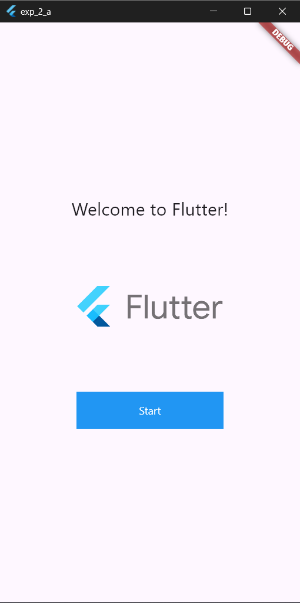

# exp_2_a.  Exploring Flutter Widgets

## Objective
In this lab experiment, we will explore various Flutter widgets such as `Text`, `Image`, and `Container`. Follow the steps below to set up a basic Flutter application and customize it according to your needs.

## Prerequisites
- Flutter SDK installed on your machine
- A code editor of your choice (e.g., Visual Studio Code)

## Procedure

1. Create a new Flutter project by running the following command in your terminal:
    ```
    flutter create my_flutter_app
    ```
    The command creates a Flutter project directory called `my_flutter_app` that contains a simple demo app that uses [Material Components](https://m3.material.io/components).

2. Change to the Flutter project directory.
    ```
    cd my_flutter_app
    ```
3. Open the `lib/main.dart` file in your Flutter project.

4. Replace the existing code with the following code snippet:

    ```dart
    import 'package:flutter/material.dart';

    void main() {
        runApp(const MainApp());
    }

    class MainApp extends StatelessWidget {
    const MainApp({super.key});

    @override
    Widget build(BuildContext context) {
        return MaterialApp(
        home: Scaffold(
            body: Center(
            child: Column(
                mainAxisAlignment: MainAxisAlignment.center,
                children: [
                const Text(
                    'Welcome to Flutter!',
                    style: TextStyle(fontSize: 24),
                ),
                const SizedBox(height: 16),
                Image.asset(
                    'assets/images/flutter_logo.png',
                    width: 200,
                    height: 200,
                ),
                const SizedBox(height: 16),
                Container(
                    width: 200,
                    height: 50,
                    color: Colors.blue,
                    child: const Center(
                    child: Text(
                        'Start',
                        style: TextStyle(color: Colors.white),
                    ),
                    ),
                ),
                ],
            ),
            ),
        ),
        );
    }
    }
    ```
5. Get the image `flutter_logo.png` from [wikipedia](https://en.wikipedia.org/wiki/File:Google-flutter-logo.png) and save it in the `assets/images/` directory of your Flutter project or replace the image path `'assets/images/flutter_logo.png'` with the actual path to your image file.

6. Save the file.

7. Run your Flutter project using the following command:
    ```
    flutter run
    ```

## Expected Output


## Conclusion
You have successfully set up a basic Flutter application and explored various Flutter widgets. Feel free to customize the code further and experiment with different widgets to create your desired UI. 

Remember to refer to the official Flutter documentation for more information on available widgets and their usage.

For additional practice, you can watch this [Positioned class](https://youtu.be/EgtPleVwxBQ) on Flutter development.