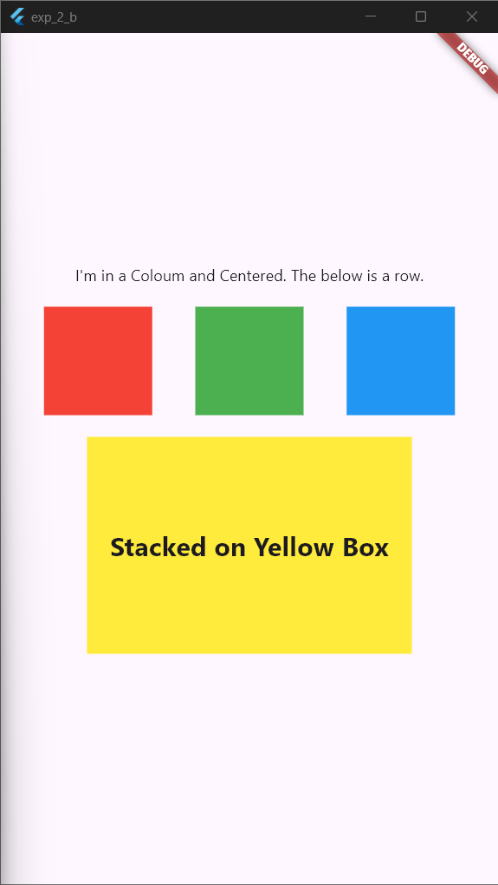

# Experiment 2 - Part B: **Flutter Layout Widgets**

## Aim
To implement different layout structures using Row, Column, and Stack widgets in Flutter.

## Objective
In this lab experiment, we will explore three important layout widgets in Flutter: `Row`, `Column`, and `Stack`. These widgets allow us to arrange child widgets in different ways to create flexible and responsive layouts.

## Prerequisites
- Flutter SDK installed on your machine
- A code editor of your choice (e.g., Visual Studio Code)

## Procedure

1. Create a new Flutter project by running the following command in your terminal:
    ```cmd
    flutter create my_flutter_app
    ```
    The command creates a Flutter project directory called `my_flutter_app` that contains a simple demo app that uses [Material Components](https://m3.material.io/components).

2. Change to the Flutter project directory.
    ```cmd
    cd my_flutter_app
    ```
3. Open the `lib/main.dart` file in your Flutter project.

4. Replace the existing code with the following code snippet:
    ```dart
    import 'package:flutter/material.dart';

    void main() {
    runApp(const MainApp());
    }

    class MainApp extends StatelessWidget {
    const MainApp({super.key});

    @override
    Widget build(BuildContext context) {
        return const MaterialApp(
        home: Scaffold(
            body: LayoutApp(),
        ),
        );
    }
    }

    class LayoutApp extends StatelessWidget {
    const LayoutApp({super.key});

    @override
    Widget build(BuildContext context) {
        return Column(
        mainAxisAlignment: MainAxisAlignment.center,
        children: [
            const Text('I\'m in a Coloum and Centered. The below is a row.'),
            const SizedBox(height: 20),
            Row(
            mainAxisAlignment: MainAxisAlignment.spaceEvenly,
            children: [
                // Create a list of Container widgets using a regular for loop
                for (var color in [Colors.red, Colors.green, Colors.blue])
                Container(
                    width: 100,
                    height: 100,
                    color: color,
                ),
            ],
            ),
            const SizedBox(height: 20),
            // Add a Stack widget to overlay a container and text
            Stack(
            alignment: Alignment.center,
            children: [
                Container(
                width: 300,
                height: 200,
                color: Colors.yellow,
                ),
                const Text(
                'Stacked on Yellow Box',
                style: TextStyle(fontSize: 24, fontWeight: FontWeight.bold),
                ),
            ],
            ),
        ],
        );
    }
    }
    ```
5. Save the file.

6. Run your Flutter project using the following command:
    ```cmd
    flutter run
    ```
    Select the appropriate device to run the app.

7.  - Enter `r` to hot reload the app and see the changes you made to the code.
    - Enter `q` to quit the app.


## Expected Output



### 1. Row Widget:
- Use the `Row` widget to arrange child widgets horizontally in a row.
- Wrap the child widgets with `Expanded` widget to distribute the available space evenly.
- Utilize the `mainAxisAlignment` property to control the alignment of child widgets along the main axis.
- Utilize the `crossAxisAlignment` property to control the alignment of child widgets along the cross axis.

### 2. Column Widget:
- Use the `Column` widget to arrange child widgets vertically in a column.
- Wrap the child widgets with `Expanded` widget to distribute the available space evenly.
- Utilize the `mainAxisAlignment` property to control the alignment of child widgets along the main axis.
- Utilize the `crossAxisAlignment` property to control the alignment of child widgets along the cross axis.

### 3. Stack Widget:
- Use the `Stack` widget to overlay child widgets on top of each other.
- Utilize the `Positioned` widget to position child widgets within the stack.
- Utilize the `alignment` property to control the alignment of child widgets within the stack.

> Remember to import the necessary Flutter packages and use the appropriate widget constructors to create the desired layout structures.

## Conclusion
In this lab experiment, we learned how to use the `Row`, `Column`, and `Stack` widgets in Flutter to create flexible and responsive layouts. These widgets allow us to arrange child widgets in different ways to achieve visually appealing user interfaces for our Flutter apps.


## References
- [Flutter Layout](https://docs.flutter.dev/ui/layout)
- [Flutter Layout Cheat Sheet](https://medium.com/flutter-community/flutter-layout-cheat-sheet-5363348d037e)
