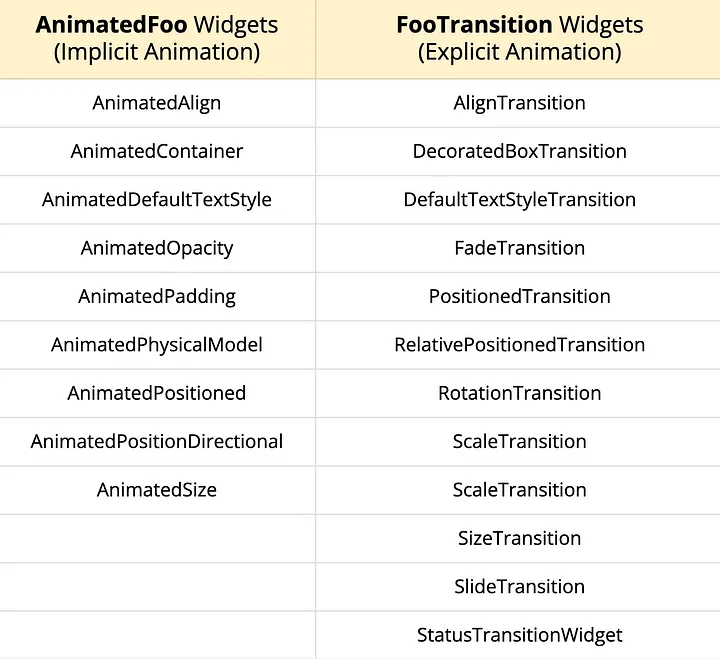

# Experiment 2 - Part B:  **Different types of animations**

## Aim
To experiment with different types of animations in Flutter.
## Objective
To understand the different types of animations in Flutter and how to implement them in a Flutter app.

## System Requirements
- **Flutter SDK**: version 2.0.0 or higher
- **Dart SDK**: version 2.12.0 or higher
- **IDE**: Visual Studio Code (latest version) or android studio (latest version)
- **Operating System**: Windows (7 or higher), macOS (10.12 or higher), or Linux (Ubuntu, Debian, Fedora, CentOS, or similar)

## Procedure

1. Create a new Flutter project by running the following command in your terminal:
    ```cmd
    flutter create my_flutter_app
    ```
    The command creates a Flutter project directory called `my_flutter_app` that contains a simple demo app that uses [Material Components](https://m3.material.io/components).

2. Change to the Flutter project directory.
    ```cmd
    cd my_flutter_app
    ```
3. Open the `lib/main.dart` file in your Flutter project.

4. Replace the existing code with the following code snippet:
    ```dart
    import 'package:flutter/material.dart';

    void main() {
      runApp(const MyApp());
    }

    class MyApp extends StatelessWidget {
      const MyApp({super.key});

      @override
      Widget build(BuildContext context) {
        return const MaterialApp(
          home: AnimationDemo(),
        );
      }
    }

    class AnimationDemo extends StatefulWidget {
      const AnimationDemo({super.key});

      @override
      State<AnimationDemo> createState() => _AnimationDemoState();
    }

    class _AnimationDemoState extends State<AnimationDemo>
        with TickerProviderStateMixin {
      late AnimationController _scaleController;
      late Animation<double> _scaleAnimation;
      late AnimationController _fadeController;
      late Animation<double> _fadeAnimation;
      late AnimationController _slideController;
      late Animation<Offset> _slideAnimation;
      late AnimationController _rotateController;
      late Animation<double> _rotateAnimation;
      bool _visible = false;
      bool _sliding = false;
      bool _rotating = false;
      bool _scaling = true;

      @override
      void initState() {
        super.initState();

        _fadeController = AnimationController(
          vsync: this,
          duration: const Duration(seconds: 1),
        );
        _fadeAnimation = Tween<double>(begin: 1, end: 0).animate(_fadeController);

        _slideController = AnimationController(
          vsync: this,
          duration: const Duration(seconds: 1),
        );
        _slideAnimation = Tween<Offset>(
          begin: const Offset(-1.0, 0.0),
          end: const Offset(1.0, 0.0),
        ).animate(_slideController);

        _rotateController = AnimationController(
          vsync: this,
          duration: const Duration(seconds: 2),
        );
        _rotateAnimation =
            Tween<double>(begin: 0, end: 1).animate(_rotateController);

        _scaleController = AnimationController(
          vsync: this,
          duration: const Duration(seconds: 2),
        )..repeat(reverse: true);
        _scaleAnimation = CurvedAnimation(
          parent: _scaleController,
          curve: Curves.easeInOut,
        );
      }

      @override
      void dispose() {
        _scaleController.dispose();
        _fadeController.dispose();
        _slideController.dispose();
        _rotateController.dispose();
        super.dispose();
      }

      @override
      Widget build(BuildContext context) {
        return Scaffold(
          appBar: AppBar(
            title: const Text('Animation Demo'),
          ),
          body: Center(
            child: Column(
              mainAxisAlignment: MainAxisAlignment.center,
              children: [
                FadeTransition(
                  opacity: _fadeAnimation,
                  child: SlideTransition(
                    position: _slideAnimation,
                    child: RotationTransition(
                      turns: _rotateAnimation,
                      child: ScaleTransition(
                        scale: _scaleAnimation,
                        child: const FlutterLogo(size: 100),
                      ),
                    ),
                  ),
                ),
                SwitchListTile(
                  title: const Text('Fade'),
                  value: _visible,
                  onChanged: (bool value) {
                    setState(() {
                      _visible = value;
                      _visible
                          ? _fadeController.forward()
                          : _fadeController.reverse();
                    });
                  },
                ),
                SwitchListTile(
                  title: const Text('Slide'),
                  value: _sliding,
                  onChanged: (bool value) {
                    setState(() {
                      _sliding = value;
                      _sliding
                          ? _slideController.repeat(reverse: true)
                          : _slideController.stop();
                    });
                  },
                ),
                SwitchListTile(
                  title: const Text('Rotate'),
                  value: _rotating,
                  onChanged: (bool value) {
                    setState(() {
                      _rotating = value;
                      _rotating
                          ? _rotateController.repeat()
                          : _rotateController.stop();
                    });
                  },
                ),
                SwitchListTile(
                  title: const Text('Scale'),
                  value: _scaling,
                  onChanged: (bool value) {
                    setState(() {
                      _scaling = value;
                      _scaling
                          ? _scaleController.repeat(reverse: true)
                          : _scaleController.stop();
                    });
                  },
                ),
              ],
            ),
          ),
        );
      }
    }
    ```

5. Save the file.

6. Run your Flutter project using the following command:
    ```cmd
    flutter run
    ```
    Select the appropriate device to run the app.

7. During the app execution, you can use the following commands:
    - Enter `r` to hot reload the app and see the changes you made to the code.
    - Enter `q` to quit the app.


## Output
<video controls src="exp_8_b_output.mp4" title="FooTransition Animations"></video>

## Conclusion
In this experiment, we learned how to implement different types of animations in a Flutter app. We used the `FadeTransition`, `SlideTransition`, `RotationTransition`, and `ScaleTransition` widgets to create fade, slide, rotate, and scale animations, respectively. We also used the `AnimationController` class to control the animations and the `Tween` class to define the animation values. By combining these widgets and classes, we were able to create a simple animation demo app that demonstrates the use of different types of animations in Flutter.


## Notes


- The `FadeTransition` widget is used to create a fade animation that changes the opacity of a widget from 0 to 1 or vice versa.
- The `SlideTransition` widget is used to create a slide animation that moves a widget from one position to another.
- The `RotationTransition` widget is used to create a rotation animation that rotates a widget by a specified angle.
- The `ScaleTransition` widget is used to create a scale animation that scales a widget up or down by a specified factor.

## References
- [Flutter - FadeTransition](https://youtu.be/CunyH6unILQ)
- [Animation in Flutter](https://flutter.dev/docs/development/ui/animations)
- [Flutter - AnimationTutorial](https://flutter.dev/docs/development/ui/animations/tutorial)
- [Flutter - Tween Class](https://medium.com/flutter/custom-implicit-animations-in-flutter-with-tweenanimationbuilder-c76540b47185)
- [Flutter Animations Comprehensive Guide](https://medium.com/flutter-community/flutter-animations-comprehensive-guide-cb93b246ca5d)
- [Flutter implicit animations](https://santosenoque.medium.com/master-flutter-implicit-animations-and-implicitly-animated-widgets-bcd0886fd698)
