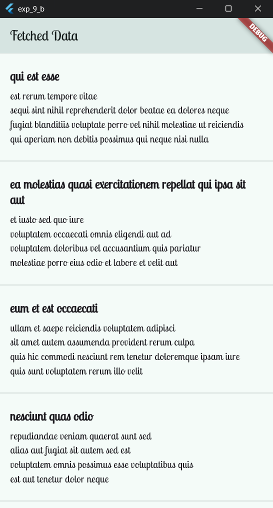

# Experiment 9 - Part B: **Display the fetched data in a meaningful way in the UI**
[](#file:exp_9_b.apk)

## Aim
To fetch data from an API and display it in a meaningful way using Flutter widgets.

## Objective
In this lab experiment, we will learn how to fetch data from an API using the `http` package and display the data in a user-friendly format using Flutter widgets such as `ListView` and `FutureBuilder`.

## System Requirements
- **Flutter SDK**: version 2.0.0 or higher
- **Dart SDK**: version 2.12.0 or higher
- **IDE**: Visual Studio Code (latest version) or Android Studio (latest version)
- **Operating System**: Windows (7 or higher), macOS (10.12 or higher), or Linux (Ubuntu, Debian, Fedora, CentOS, or similar)

## Procedure

1. Create a new Flutter project by running the following command in your terminal:
    ```cmd
    flutter create fetch_data_app
    ```
    The command creates a Flutter project directory called `fetch_data_app`.

2. Change to the Flutter project directory.
    ```cmd
    cd fetch_data_app
    ```

3. Add the `http` package to your project by updating the `pubspec.yaml` file:
    ```yaml
    dependencies:
      http: ^0.15.0
    ```
    Run `flutter pub get` to install the package.

4. Create a new file `lib/src/services/api_service.dart` and implement the API service to fetch data:
    ```dart
    // filepath: lib/src/services/api_service.dart
    import 'package:http/http.dart' as http;
    import 'dart:convert';

    class ApiService {
      Future<List<dynamic>> fetchData() async {
        final response = await http.get(Uri.parse('https://jsonplaceholder.typicode.com/posts'));
        if (response.statusCode == 200) {
          return json.decode(response.body);
        } else {
          throw Exception('Failed to load data');
        }
      }
    }
    ```

5. Create a new file `lib/src/screens/home_screen.dart` and implement the UI to display the fetched data:
    ```dart
    // filepath: lib/src/screens/home_screen.dart
    import 'package:flutter/material.dart';
    import '../services/api_service.dart';

    class HomeScreen extends StatefulWidget {
      const HomeScreen({super.key});

      @override
      State<HomeScreen> createState() => _HomeScreenState();
    }

    class _HomeScreenState extends State<HomeScreen> {
      late Future<List<dynamic>> _data;

      @override
      void initState() {
        super.initState();
        _data = ApiService().fetchData();
      }

      @override
      Widget build(BuildContext context) {
        return Scaffold(
          appBar: AppBar(
            title: const Text('Fetched Data'),
          ),
          body: FutureBuilder<List<dynamic>>(
            future: _data,
            builder: (context, snapshot) {
              if (snapshot.connectionState == ConnectionState.waiting) {
                return const Center(child: CircularProgressIndicator());
              } else if (snapshot.hasError) {
                return Center(child: Text('Error: ${snapshot.error}'));
              } else if (snapshot.hasData) {
                return ListView.separated(
                  itemCount: snapshot.data!.length,
                  separatorBuilder: (context, index) => const Divider(),
                  itemBuilder: (context, index) {
                    final item = snapshot.data![index];
                    return Padding(
                      padding: const EdgeInsets.all(16.0),
                      child: Column(
                        crossAxisAlignment: CrossAxisAlignment.start,
                        children: [
                          Text(
                            item['title'],
                            style: Theme.of(context).textTheme.titleLarge?.copyWith(
                                  fontWeight: FontWeight.bold,
                                  fontSize: 20,
                                ),
                          ),
                          const SizedBox(height: 8),
                          Text(
                            item['body'],
                            style: Theme.of(context).textTheme.bodyMedium?.copyWith(
                                  fontSize: 16,
                                ),
                          ),
                        ],
                      ),
                    );
                  },
                );
              } else {
                return const Center(child: Text('No data available'));
              }
            },
          ),
        );
      }
    }
    ```

6. Update the `lib/main.dart` file to set the `HomeScreen` as the home widget:
    ```dart
    // filepath: lib/main.dart
    import 'package:flutter/material.dart';
    import 'package:google_fonts/google_fonts.dart';
    import 'src/screens/home_screen.dart';

    void main() {
      runApp(const MainApp());
    }

    class MainApp extends StatelessWidget {
      const MainApp({super.key});

      @override
      Widget build(BuildContext context) {
        return MaterialApp(
          theme: ThemeData(
            useMaterial3: true,
            colorScheme: ColorScheme.fromSeed(seedColor: Colors.teal),
            textTheme: GoogleFonts.lobsterTwoTextTheme(
              ThemeData.light().textTheme,
            ),
          ),
          home: const HomeScreen(),
        );
      }
    }
    ```

7. Save all files.

8. Run your Flutter project using the following command:
    ```cmd
    flutter run
    ```
    Select the appropriate device to run the app.

9. During the app execution, you can use the following commands:
    - Enter `r` to hot reload the app and see the changes you made to the code.
    - Enter `q` to quit the app.

## Output


## Conclusion
In this lab experiment, we successfully fetched data from an API and displayed it in a meaningful way using Flutter widgets. This approach allows us to build dynamic and interactive apps that consume external data.

## References
- [Flutter Networking](https://docs.flutter.dev/development/data-and-backend/networking)
- [http Package Documentation](https://pub.dev/packages/http)
- [Google Fonts for Flutter](https://pub.dev/packages/google_fonts)